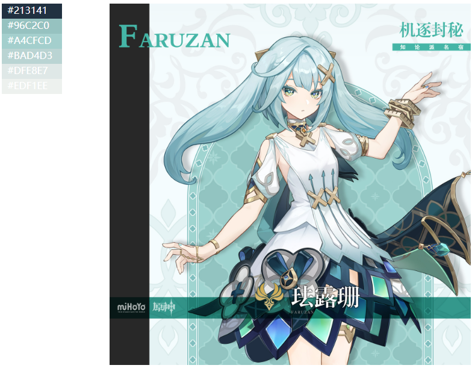
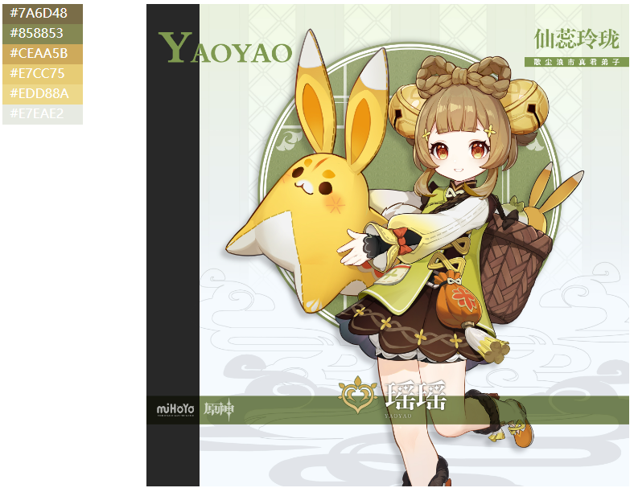

# Genshin Color Palette for ``R#``

A ``R#`` package for use the color palette that extracted from the genshin characters.

> https://stack.xieguigang.me/2023/genshin-impact-color-palettes/

## Extract theme colors

The genshin color palette data is generated via extract the image theme colors based on the ``colors`` function from the ``grDevices`` namespace:

```r
img = readImage(file);
theme_colors = grDevices::colors(img, n = 6, character = TRUE);
```

So we could create the color palette from each genshin character post, example like:




## Use the package functions

```r
require(scale_colour_genshin);

# get all character names in current package:
scale_colour_genshin::keys();
# get color palette from specific genshin character:
scale_colour_genshin::character_colorSet(name = "albedo");
# create color scaler for ggplot package
scale_colour_genshin(name = "albedo");
```
