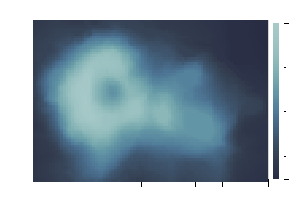
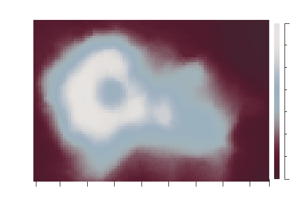

# Genshin Color Palette for ``R#``

A ``R#`` package for use the color palette that extracted from the genshin characters.

> https://stack.xieguigang.me/2023/genshin-impact-color-palettes/

## Extract theme colors

The genshin color palette data is generated via extract the image theme colors based on the ``colors`` function from the ``grDevices`` namespace:

```r
img = readImage(file);
theme_colors = grDevices::colors(img, n = 6, character = TRUE);
```

So we could create the color palette from each genshin character post, example like:


## Use the package functions

```r
require(scale_colour_genshin);

# get all character names in current package:
scale_colour_genshin::keys();
# get color palette from specific genshin character:
scale_colour_genshin::character_colorSet(name = "albedo");
# create color scaler for ggplot package
scale_colour_genshin(name = "albedo");
```

## ggplot demo

```r
require(ggplot);
require(Matrix);
require(scale_colour_genshin);

# load data
data(volcano);

volcano = as.matrix(volcano);
volcano = melt(volcano, varnames = c("X", "Y"), value_name = "Height");

print(volcano, max.print = 13);

let ggplot2 = function(genshin_colors) {
  p <- ggplot(volcano, aes(x = "X", y = "Y"),padding = "padding:10% 10% 10% 12%;") +
     geom_tile(aes(fill = "Height")) +
     scale_fill_distiller(palette = genshin_colors, direction = 1) +
     theme_light(
        axis.text = element_text(family = "Cambria Math", size = 20),
        axis.title = element_text(family = "Cambria Math", size = 36),
        legend.tick = element_text(family = "Cambria Math", size = 18)
     ) +
     labs(title = "Volcano Height Map");
  p;
}

for(let color_name in scale_colour_genshin::keys()) {
   png(filename = relative_work(`volcano_genshin_${color_name}.png`), 
      width = 600, 
      height = 400, 
      bg = "white");
      
   plot(ggplot2(`genshin:${color_name}`));
   dev.off();
}
```



